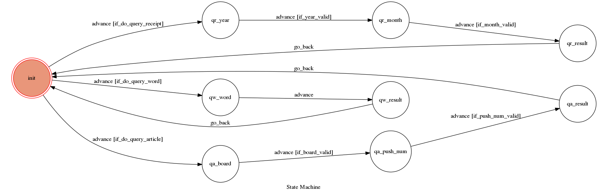
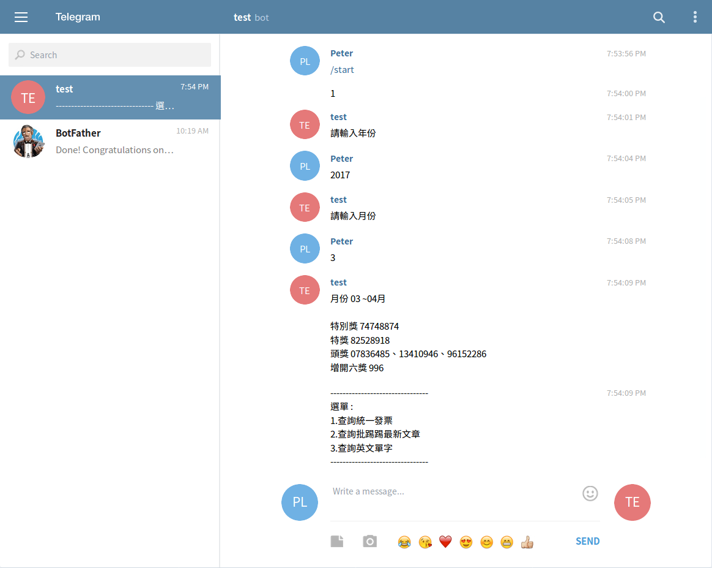
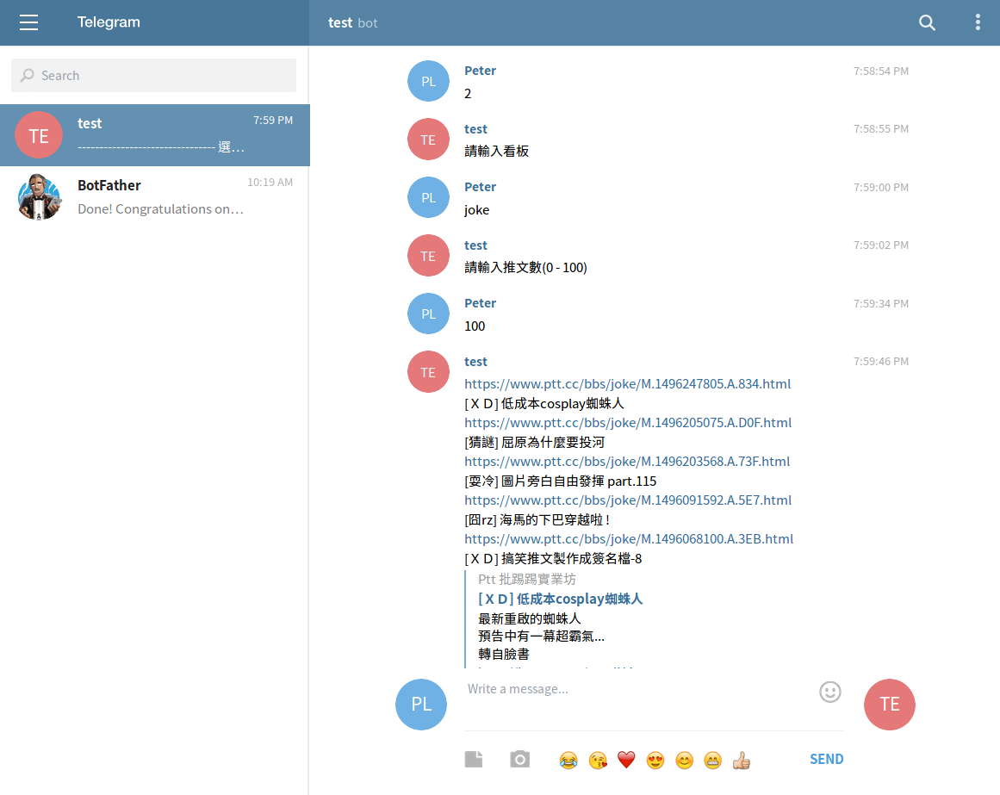
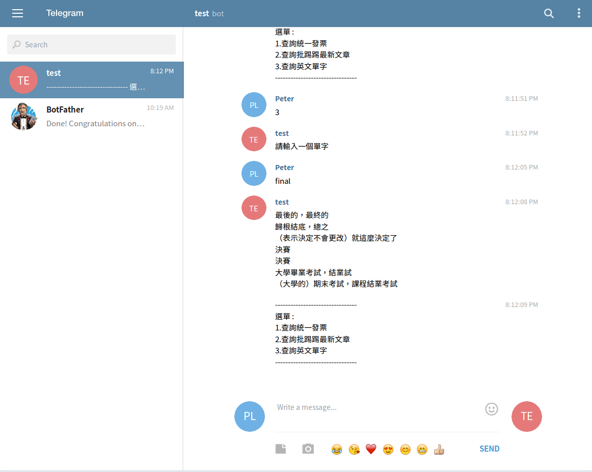

# TOC Project 2017

A telegram bot based on a finite state machine

This telegram bot contains three features:

1. Search for uniform-invoice prize winning numbers
2. Search for newest articles in [PTT](https://www.ptt.cc/bbs/index.html) website
3. Search for vocabulary in English-Chinese(Traditional) dictionary

## Setup

### Prerequisite
* Python 3 

#### Install Dependency
Simply use `pip3` command to install from the requirements file
```sh
pip3 install -r requirements.txt
```

Below is the list of required packages:
* Flask
* transitions
* pygraphviz (For visualizing Finite State Machine)
    * [Setup pygraphviz on Ubuntu](http://www.jianshu.com/p/a3da7ecc5303)
* python-telegram-bot
* requests (For HTTP requests)
* beautifulsoup4 (For pulling out data from HTML files)

### Secret Data

`API_TOKEN` and `WEBHOOK_URL` in app.py **MUST** be set to proper values.
Otherwise, you might not be able to run your code.

You can get `API_TOKEN` from @botfather ([web link](https://web.telegram.org/#/im?p=@BotFather))

### Run Locally
You can either setup https server or using [`ngrok`](https://ngrok.com/) as a proxy.

**`ngrok` would be used in the following instruction**

**(or run the executable file with same arguments)**

```sh
ngrok http 5000
```

After that, `ngrok` would generate a https URL.

You should set `WEBHOOK_URL` (line 11 in app.py) to `your-https-URL/hook`.

```
API_TOKEN = '383537012:AAFzocUZyF14VUSIWaz8bw3H94eElibhjLc'
WEBHOOK_URL = 'https://610cef08.ngrok.io/hook'
```

#### Run the server

```sh
python3 app.py
```

## Finite State Machine


## Usage
The initial state is set to `init`.

There has three branches leave from `init`. These branches correspond to different features memtioned above.

If the user entered "1", "2" or "3", `init` is triggered to `advance` to the corresponding state, and telegram bot will ask for more details in order to retrive data the user want

Finally, if the result has sent to the user, states will `go_back` to `init` state

## Snapshots

Sequence of actions started from typing "1" at `init` state


Sequence of actions started from typing "2" at `init` state


Sequence of actions started from typing "3" at `init` state


## Author
[petermouse](https://github.com/petermouse)

The project template is provided by [Lee-W](https://github.com/Lee-W)